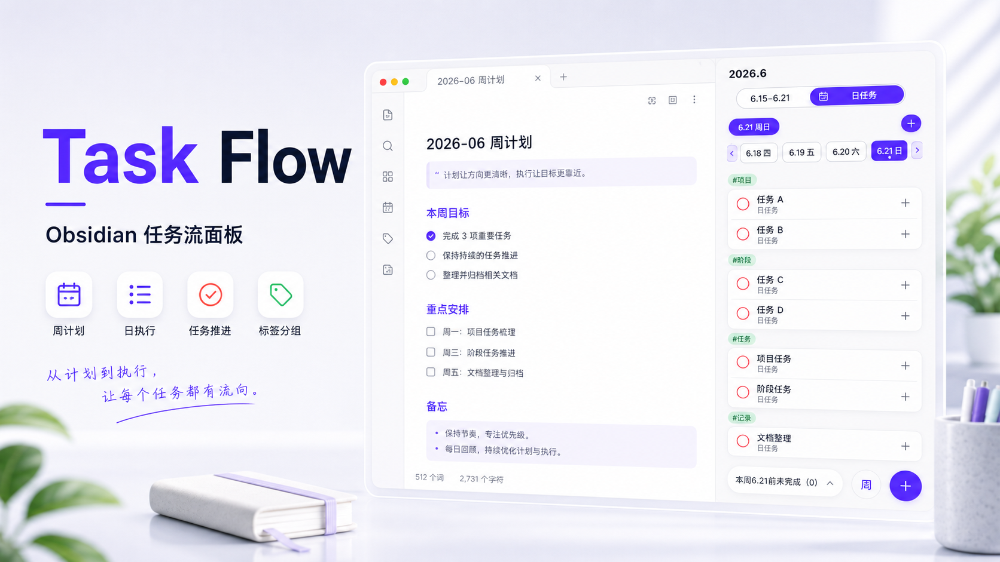
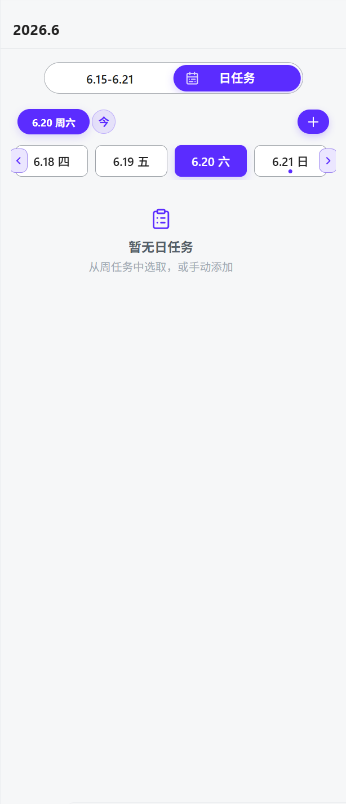
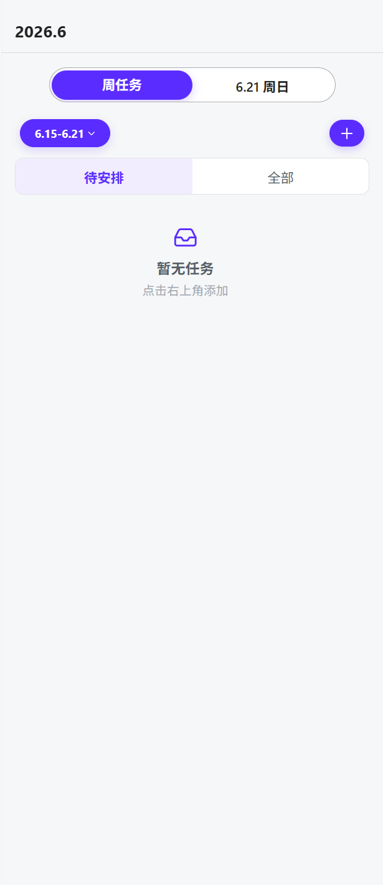
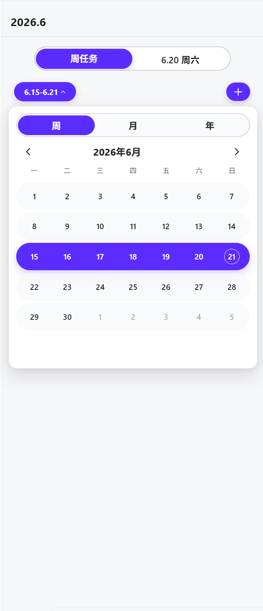
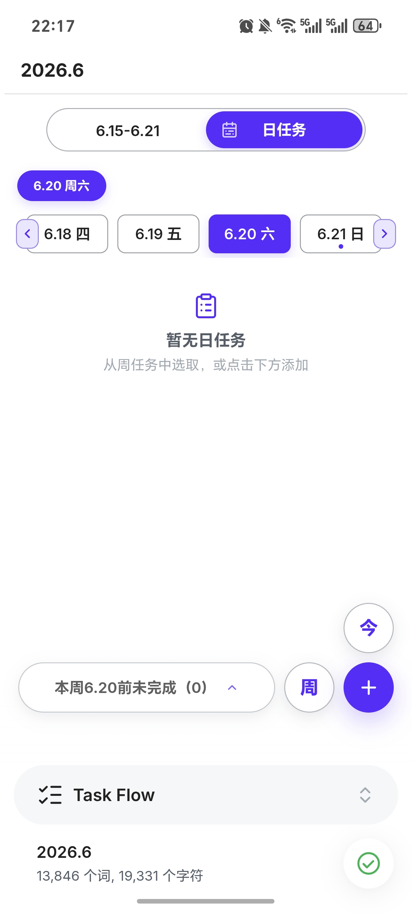
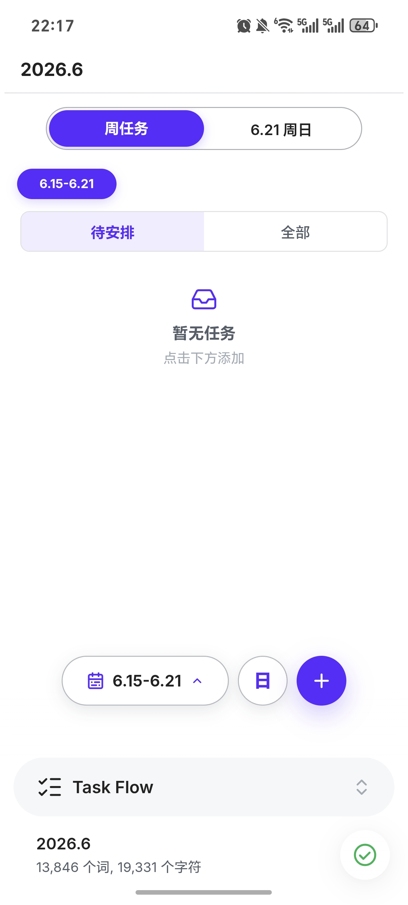
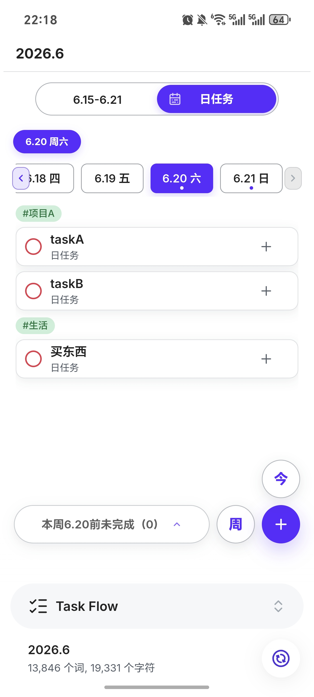
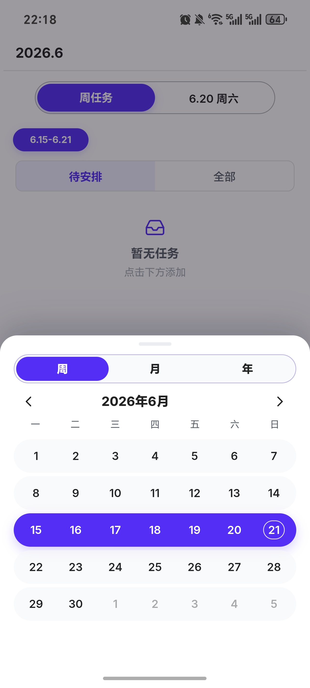

# Task Flow

Task Flow 是一个 Obsidian 任务流插件。

它用侧边栏把 Markdown 中的周任务、日任务、子任务、状态、工作记录和标签整理成一套可执行的任务流程。任务仍然写在 Obsidian 文档里，侧边栏负责每天真正使用时的查看、创建、推进和调整。



## 核心设计：Markdown 记录，侧边栏执行

Task Flow 不把任务从 Obsidian 里拿走。它把“记录”和“执行”分开处理：

- Markdown 文档保存任务内容、状态、标签和任务 ID
- 侧边栏负责日常查看、创建、推进和调整任务
- 周任务、日任务、子任务和工作记录都围绕同一份文档同步
- 不打开 Task Flow 时，任务仍然是 Obsidian 中可读的 Markdown 内容

这让 Task Flow 更像是 Obsidian 文档旁边的任务操作台，而不是一个脱离文档的独立待办 App。

## 任务时间线：从周计划到日执行

Task Flow 的任务分为两个主要区域：周任务和日任务。它们对应的是一条从计划到执行的时间线。

- 周任务：承接本周范围内要处理的事情
- 日任务：执行某一天真正要做的任务
- 周任务可以安排到具体日期，成为当天的日任务
- 日任务也可以加入周任务，让临时出现的事项回到本周计划里
- 面板可以独立选择周和日期，不依赖当前打开的文档

只要目标月份文档中存在对应的周区域或日期区域，Task Flow 就可以把这些操作同步回 Markdown。

## 任务结构：从一个任务到一组任务

Task Flow 里的任务不只是单行待办。一个任务可以继续拆成更小的执行结构。

- 普通任务：一条独立事项
- 父任务：包含子任务的任务
- 子任务：父任务下的一层执行项
- 父任务进度会根据子任务汇总
- 当前版本支持一层子任务

子任务会参与周任务安排、日任务移动、任务延续和状态同步。这样，一个较大的任务可以从周计划进入某一天，再在执行时继续拆分，而不丢失它和原任务之间的关系。

## 任务推进：状态、延续、移动

Task Flow 不只关心任务是否完成，也关心任务在不同日期之间怎么继续推进。

- 未开始：可以移动到同一周的其他日期
- 进行中：可以延续到同一周的后续日期
- 已完成：会同步到相关任务状态
- 周任务安排到日任务时，会保留来源关系
- 日任务移动或延续时，会同步更新 Markdown 文档

延续不是简单复制一行文字。Task Flow 会维护任务之间的来源关系，让不同日期中的同源任务可以继续关联。

## 工作记录：任务执行后的落点

任务完成之前，很多时候还需要留下执行过程。Task Flow 用工作记录承接这部分内容。

- 任务可以跳转到对应的工作记录位置
- 工作记录通过 `tasklog::` 和任务建立关联
- 创建工作记录后，任务可以进入进行中状态
- 删除或移除工作记录时，任务状态会重新计算
- 工作记录让任务从“要做什么”继续走到“做了什么”

这让任务不只是一个勾选框，也能和实际执行过程连起来。

## 任务整理：顺序、标签和视图分组

Task Flow 会维护任务在周任务和日任务中的顺序，并支持拖拽调整。父任务下的子任务只在父任务内部调整顺序，普通任务在当前任务列表中调整顺序。

标签属于任务整理的一部分。你可以使用 Obsidian 原生 `#标签` 给任务分类，例如：

```text
#项目A #阶段1 写测试用例
```

保存到 Markdown 后会变成：

```markdown
- [ ] 写测试用例 #项目A #阶段1
```

侧边栏会使用前两个标签参与当前任务列表的分组：第一个标签作为主标签，第二个标签作为子标签。没有标签的任务会直接显示在上方；有标签的任务会进入对应标签组。标签菜单还可以用于新增标签任务、编辑标签名称和调整标签顺序。

桌面端通过右键标签打开菜单，手机端通过长按标签打开菜单。

## 桌面端和手机端体验

桌面端适合把 Markdown 文档和 Task Flow 面板并排使用。文档负责承载内容，面板负责推进任务。

手机端使用同一套任务数据和任务规则，但交互更偏向触控：底部操作栏用于快速切换、创建和查看任务，长按用于打开标签等上下文菜单。

两端的目标是一致的：不管在电脑还是手机上，都能围绕同一份 Markdown 任务继续工作。

## 界面展示

### 日任务视图

日任务是每天执行任务的主要入口。



### 周任务视图

周任务用于整理本周任务和待安排事项。



### 时间选择器

时间选择器用于切换周和日期。



### 手机端

手机端保留完整任务流，并针对底部操作和触控菜单做了适配。

<table>
  <tr>
    <td></td>
    <td></td>
  </tr>
  <tr>
    <td></td>
    <td></td>
  </tr>
</table>

## Markdown 保存格式

Task Flow 使用普通 Markdown 任务行保存任务：

```markdown
- [ ] 写测试用例 #项目A #阶段1 ^tf-d-0001
```

状态会映射到 Markdown 任务标记：

```markdown
- [ ] 未开始
- [/] 进行中
- [x] 已完成
```

每个任务会带有块引用 ID，用来维持侧边栏任务和文档任务之间的对应关系。周区域和日区域通过文档中的注释标记定位，标签则继续使用 Obsidian 原生 `#标签`。

## 安装

当前仓库默认不提交构建产物，需要本地构建后安装。

```powershell
npm install
npm run build
```

构建完成后会生成：

```text
dist/task-flow/
```

把整个 `task-flow` 文件夹复制到 Obsidian 仓库的插件目录：

```text
.obsidian/plugins/
```

然后在 Obsidian 设置中启用 Task Flow。

## 开发

项目需要 Node.js 20 或更高版本。

```powershell
npm install
npm run build
npm test
```

主要目录：

```text
src/
├─ main.ts                 插件入口
└─ v2/                     Task Flow V2 源码

scripts/                   构建和测试脚本
doc/                       方案、计划和交接文档
picture/                   README 展示图片
package.json               依赖和脚本
tsconfig.json              TypeScript 配置
esbuild.config.mjs         打包配置
versions.json              Obsidian 插件版本兼容信息
```

## 项目状态

当前仓库是 Task Flow 2.1 / 2.1.1 的源码工程。

这个版本已经形成以周任务、日任务、子任务、状态、工作记录和任务整理为核心的完整任务流。后续升级会继续围绕 UI 细节、跨端体验和更细的任务管理能力推进。
