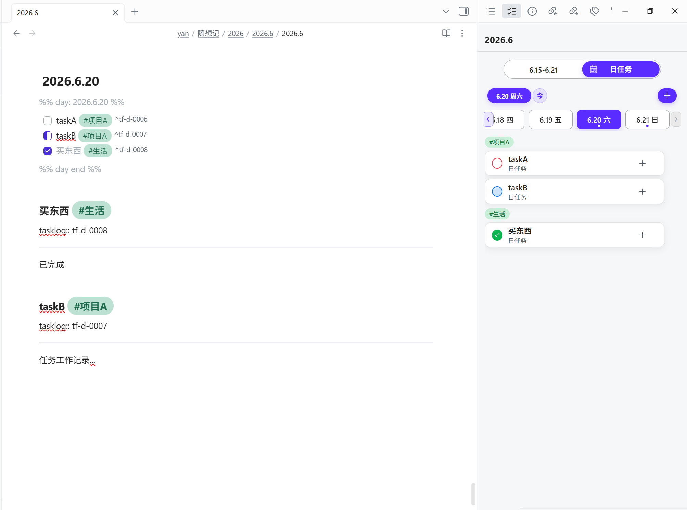

# Task Flow

Task Flow 是一个面向 Obsidian 的侧边栏任务管理插件。

它保留 Markdown 文档作为任务的真实存储位置，同时提供一个更适合日常执行的任务面板：日任务、周任务、标签分组、任务状态、子任务、任务延续和工作记录，都可以在 Obsidian 侧边栏里完成。

这个插件更适合这样的使用方式：

- 把 Obsidian 当作长期笔记和工作记录系统
- 希望任务继续写进 Markdown 文档，而不是进入一个完全独立的数据库
- 每天需要一个清晰的任务面板来查看、创建、推进和整理任务
- 同时在桌面端和手机端使用 Obsidian

## 界面预览

### 桌面端总览

在桌面端，Task Flow 可以和 Markdown 文档并排使用。左侧仍然是原始文档内容，右侧是任务面板。



### 日任务

日任务视图用于处理某一天的具体任务。任务可以按照标签分组显示，也可以直接创建、完成、编辑和继续拆分。


### 周任务

周任务视图用于查看当前周的任务安排，并支持待安排任务和全部任务之间的切换。


### 时间选择

Task Flow 有自己的时间选择器，用来切换目标日期或目标周，不依赖当前打开的文档位置。


### 手机端

手机端保留和桌面端一致的任务逻辑，同时针对底部操作、任务列表和触控操作做了适配。

<p>
  
  
  
  
</p>

## 核心能力

### 独立任务面板

Task Flow 在 Obsidian 中提供独立侧边栏面板。你可以在任意文档中查看和操作任务，任务仍然会写回对应的月度 Markdown 文档。

这意味着任务面板负责“执行和管理”，Markdown 文档负责“长期保存和可读记录”。

### 日任务与周任务

插件支持日任务和周任务两种主要工作状态。

日任务更适合处理今天或某一天的具体事项；周任务更适合做一周范围内的安排、回顾和待安排任务整理。

### Markdown 存储

任务最终仍然以 Markdown 任务列表的形式保存，例如：

```markdown
- [ ] 写测试用例 #项目A #阶段1
```

这样做的好处是，即使不打开插件，任务内容也仍然是可读、可搜索、可迁移的普通 Markdown。

### 标签分组

Task Flow 支持 Obsidian 原生 `#标签` 语法，并在侧边栏中按标签分组展示任务。

创建或编辑任务时，可以在任务开头输入标签：

```text
#项目A #阶段1 写测试用例
```

保存到 Markdown 后会整理为：

```markdown
- [ ] 写测试用例 #项目A #阶段1
```

当前版本只使用前两个标签参与 Task Flow 分组：

- 第一个标签是主标签
- 第二个标签是子标签
- 更多标签会继续作为普通 Obsidian 标签保留

如果一个主标签下的同一个子标签只有一个任务，侧边栏不会强行显示子分组；当同一子标签下有多个任务时，才会显示子标签分组。

### 标签菜单与排序

桌面端可以右键标签胶囊打开标签菜单，手机端可以长按标签胶囊打开标签菜单。

当前标签菜单支持围绕标签继续创建任务、编辑标签名称和调整标签顺序。标签排序会影响侧边栏显示顺序，并通过现有任务顺序结构维护。

### 任务操作

Task Flow 支持常用任务操作：

- 创建任务
- 编辑任务
- 完成和取消完成
- 删除任务
- 创建子任务
- 任务延续
- 任务移动
- 工作记录跳转

这些操作都围绕 Markdown 中的任务内容进行，不会把任务锁死在插件内部。

### 桌面端与手机端

桌面端更适合在文档和任务面板之间来回切换；手机端更适合快速查看、创建和推进任务。

两端使用同一套任务规则，只在交互方式上做差异：例如桌面端使用右键打开标签菜单，手机端使用长按打开标签菜单。

## 安装使用

当前仓库默认不提交构建产物。你可以在本地构建后安装到 Obsidian。

先安装依赖：

```powershell
npm install
```

然后构建插件：

```powershell
npm run build
```

构建完成后，会生成：

```text
dist/task-flow/
```

把整个 `task-flow` 文件夹复制到你的 Obsidian 仓库：

```text
.obsidian/plugins/
```

然后在 Obsidian 设置中启用 Task Flow。

## 开发

运行测试：

```powershell
npm test
```

项目需要 Node.js 20 或更高版本。

## 项目结构

```text
src/
├─ main.ts                 插件入口
└─ v2/                     Task Flow V2 源码

scripts/                   构建和测试脚本
doc/                       方案、计划和交接文档
picture/                   README 展示图片
package.json               依赖和脚本
tsconfig.json              TypeScript 配置
esbuild.config.mjs         打包配置
versions.json              Obsidian 插件版本兼容信息
```

## 当前状态

当前版本是 Task Flow 2.1 / 2.1.1 的源码工程。

已完成的主要能力包括：

- 全局任务面板
- 日任务与周任务
- 标签分组
- 标签菜单与标签排序
- 桌面端和手机端基础适配

后续如果继续升级，重点会放在更细的 UI 体验、更多标签相关操作，以及更稳定的跨端使用体验上。

## 说明

这是一个个人工作流驱动的 Obsidian 插件项目。它优先服务于“在 Obsidian 里长期记录，同时用侧边栏高效执行任务”的使用方式。
